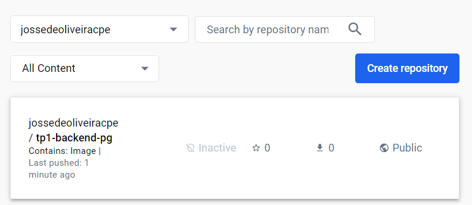

### Link Application
[Back](../README.md)
#### Docker compose
Using this command
```sh
$ (cd ./tp-1/docker-compose && docker compose up)
```

#### Docker push
```sh
$ docker tag tp1-backend-pg jossedeoliveiracpe/tp1-backend-pg:1.0
$ docker push jossedeoliveiracpe/tp1-backend-pg:1.0
```

Use pushed images
