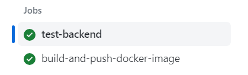

## TP2

### Creating the repo
We use a new repository, but link it with this using `git submodule`

### First CI
Adding a new main.yml file:
```yaml
name: CI devops 2024

# Triggering it on push and pull requests
on:
  push:
    branches:
     - main
     - develop
  pull_request:
    branches:
     - main
     - develop

jobs:
  test-backend: 
    runs-on: ubuntu-22.04
    steps:
      - uses: actions/checkout@v2.5.0

      - name: Set up JDK 17
        uses: actions/setup-java@v3
        with:
          java-version: '17'
          distribution: 'temurin'
          architecture: x64

      - name: Build and test with Maven
        run: mvn clean verify
```


### First CD
We add a new job:
```yaml
  build-and-push-docker-image:
    needs: test-backend
    runs-on: ubuntu-22.04

    steps:
      - name: Checkout code
        uses: actions/checkout@v2.5.0

      - name: Login to DockerHub
        run: docker login -u ${{ secrets.DOCKERHUB_USERNAME }} -p ${{ secrets.DOCKERHUB_TOKEN }}


      - name: Build image and push backend
        uses: docker/build-push-action@v3
        with:
          context: .
          tags:  ${{secrets.DOCKERHUB_USERNAME}}/tp-devops-simple-api:latest
          push: ${{ github.ref == 'refs/heads/main' }}

      - name: Build image and push database
        uses: docker/build-push-action@v3
        with:
          context: ./deployment/database
          tags:  ${{secrets.DOCKERHUB_USERNAME}}/tp-devops-database:latest
          push: ${{ github.ref == 'refs/heads/main' }}

      - name: Build image and push httpd
        uses: docker/build-push-action@v3
        with:
          context: ./deployment/router
          tags:  ${{secrets.DOCKERHUB_USERNAME}}/tp-devops-httpd:latest
          push: ${{ github.ref == 'refs/heads/main' }}
```
And it works ! \


### Sonar
We add this to Backend test:
```
    - name: Sonar Check
    run: mvn -B verify sonar:sonar -Dsonar.projectKey=josse-devops-cpe-lyon_simple-api -Dsonar.organization=josse-devops-cpe-lyon -Dsonar.host.url=https://sonarcloud.io -Dsonar.login=${{ secrets.SONAR_TOKEN }}
```

We do not create a new job because we can re-use the previous installation of java to make the CI **faster**


