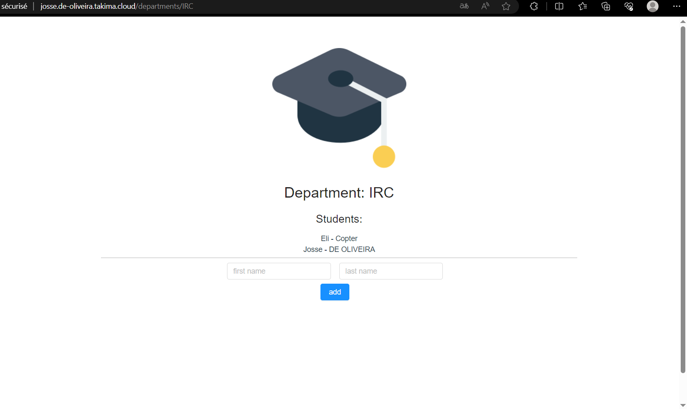

## TP 3
*By Josse DE OLIVEIRA*\
[Go Back](../README.md)

### Facts
Having the following setup file:
```yaml
all:
 vars:
   ansible_user: centos
   ansible_ssh_private_key_file: ~/tp-3/ansible/keys/id_rsa
 children:
   prod:
     hosts: josse.de-oliveira.takima.cloud
```
Running commands:

```shell
ansible$ ansible all -i inventories/setup.yml -m ping

josse.de-oliveira.takima.cloud | SUCCESS => {
    "ansible_facts": {
        "discovered_interpreter_python": "/usr/bin/python"
    },
    "changed": false,
    "ping": "pong"
}

ansible$ ansible all -i inventories/setup.yml -m setup -a "filter=ansible_distribution*"

josse.de-oliveira.takima.cloud | SUCCESS => {
    "ansible_facts": {
        "ansible_distribution": "CentOS",
        "ansible_distribution_file_parsed": true,
        "ansible_distribution_file_path": "/etc/redhat-release",
        "ansible_distribution_file_variety": "RedHat",
        "ansible_distribution_major_version": "7",
        "ansible_distribution_release": "Core",
        "ansible_distribution_version": "7.9",
        "discovered_interpreter_python": "/usr/bin/python"
    },
    "changed": false
}

ansible$ ansible all -i inventories/setup.yml -m yum -a "name=httpd state=absent" --become

josse.de-oliveira.takima.cloud | CHANGED => {
    "ansible_facts": {
        "discovered_interpreter_python": "/usr/bin/python"
    },
    "changed": true,
    "changes": {
        "removed": [
            "httpd"
        ]
    },
    "msg": "",
    "rc": 0,
    "results": [
        # ...
    ]
}
```

**Document your inventory and base commands** \
The inventory purpose is to specify servers , and informations to log in it. In this case, by using `all` in the command, we use all the servers, we log in the only host we have, named `prod`,


### Playbook
First playbook
```shell
ansible$ ansible-playbook -i inventories/setup.yml playbook.yml 

PLAY [all] *********************************************************************

TASK [Test connection] *********************************************************
ok: [josse.de-oliveira.takima.cloud]

PLAY RECAP *********************************************************************
josse.de-oliveira.takima.cloud : ok=1    changed=0    unreachable=0    failed=0    skipped=0    rescued=0    ignored=0
```
Advanced Playbooks:
```shell
ansible$ ansible-playbook -i inventories/setup.yml playbook.yml 

PLAY [all] *********************************************************************

TASK [Install device-mapper-persistent-data] ***********************************
changed: [josse.de-oliveira.takima.cloud]

TASK [Install lvm2] ************************************************************
changed: [josse.de-oliveira.takima.cloud]

TASK [add repo docker] *********************************************************
changed: [josse.de-oliveira.takima.cloud]

TASK [Install Docker] **********************************************************
changed: [josse.de-oliveira.takima.cloud]

TASK [Install python3] *********************************************************
changed: [josse.de-oliveira.takima.cloud]

TASK [Install docker with Python 3] ********************************************
changed: [josse.de-oliveira.takima.cloud]

TASK [Make sure Docker is running] *********************************************
changed: [josse.de-oliveira.takima.cloud]

PLAY RECAP *********************************************************************
josse.de-oliveira.takima.cloud : ok=7    changed=7    unreachable=0    failed=0    skipped=0    rescued=0    ignored=0   
```

### Using roles
```shell
ansible$ ansible-galaxy init roles/docker
- Role roles/docker was created successfully
```

After that, we move all tasks to `roles/docker/tasks/main.yml` and we change `playbook.yml` : 
```yaml
- hosts: all
  gather_facts: false
  become: true
  # We execute the tasks in the role: docker
  roles:
    - role: './roles/docker'
```

**Document your playbook**\
We use the docker role to execute all its tasks

### Adding front
We will add a front-end build to the application in the GitHub Actions (same repo as TP2) and Ansible config

Docker compose won't be changed because developers will use the dev mode (`npm run serve`)

